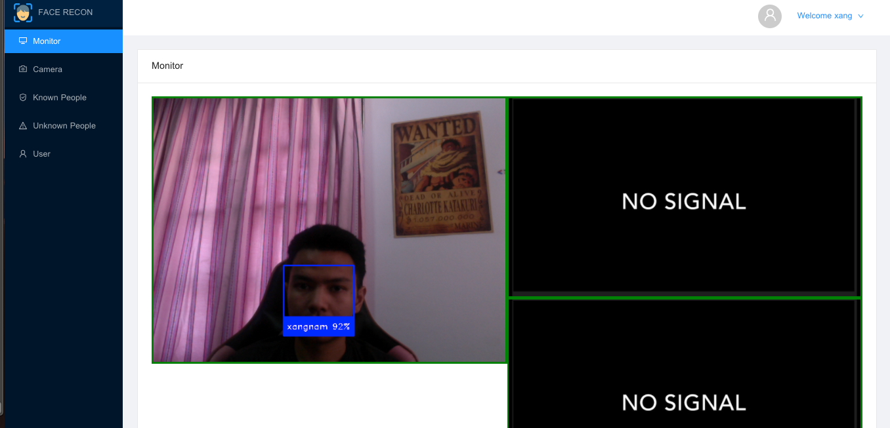

# face_recon

`face_recon` ຄື restful api ທີ່ implement `face recognition` system ພັດທະນາໂດຍໃຊ້ `Python` ແລະ `Flask` http framework ສາມາດເຊື່ອຕໍ່ Ip camera ທີ່ suport protocol `rtsp`

> Note: ຍັງຢູ່ໃນຊ່ວງພັດທະນາ ອາດມີຂໍ້ຜິດພາດຫຼາຍຈຸດ



# Concept

`face_recon` ເປັນ restful api ທີ່ມີການຈັດການຂໍ້ມູນທີ່ຈະນຳໄປໃຊ້ໃນການລະບຸຕົວຕົນຈາກໃບໜ້າ. ເຊິ່ງລວມເຖິງຮູບພາບທີ່ມີໃບໜ້າທີ່ເຮົາຕ້ອງການກວດສອບ. `face_recon` ຈະໃຊ້ຫຼັກການ face verification ເພື່ອລະບຸຕົວຕົນນັ້ນ.ໝາຍເຖິງການເອົາຮູບໃບໜ້າທີ່ມີຢູ່ໃນຖານຂໍ້ມຸນແລ້ວມາປຽບທຽບກັບຮູບໃບໜ້າທີ່ເຮົາຕ້ອງການກວດສອບ ໂດຍການປຽບທຽບນັ້ນຈະໃຊ້ວິທີຫາໄລຍະຫ່າງລະຫວ່າງ `face embedding vector` ຖ້າຫາກໄລຍະຫ່າງມີຄ່ານ້ອຍຊຳໃດກໍ່ສະແດງວ່າໃບໜ້ານັ້ນມີຄວາມຄືກັນຫຼາຍຊຳນັ້ນ

# Deshboard

face_recon ມີ Web UI ໃຫ້ໃຊ້ງານງ່າຍໆ ສາມາດຕິດຕັ້ງ ແລະ ໃຊ້ງານໄດ້ທີ່ [facerecon_dashboard](https://github.com/xang555/facerecon_dashboard)

# Installation

### requirements

ກ່ອນທີ່ຈະ run project ຕ້ອງໄດ້ຕິດຕັ້ງ environment ແລະ library ລຸ່ມນີ້ເສຍກ່ອນ

+ python3
+ tensorflow v2 [install tensorflow](https://www.tensorflow.org/install)
+ dlib [How to install dlib from source on macOS or Ubuntu](https://gist.github.com/ageitgey/629d75c1baac34dfa5ca2a1928a7aeaf)
+ face_recognition face recognition library [how to install face_recognition](https://github.com/ageitgey/face_recognition)
+ mtcnn  deep learning face detection [install mtcnn](https://github.com/ipazc/mtcnn)
+ opencv for python [install opencv for python](https://pypi.org/project/opencv-python/)

 ການຕິດຕັ້ງແມ່ນໃຊ້ `pip3` ຫຼັງຈາກນັ້ນເຂົ້າໄປທີ່ `root` project ແລ້ວໃຊ້ຄຳສັ່ງ

 ```command
 $ pip3 install -r requirements.txt
 ```

### Usage

start web server ໂດຍໃຊ້ຄຳສັ່ງ

```command
$ python3 app.py
```

ສາມາດເຂົ້າໃຊ້ງານ API ຈາກ URL [http://localhost:8080/api/v1](http://localhost:8080/api/v1)

API router [face_recon api docs](asset/face_recon_api_docs.json)

#### use webcame

ສຳລັບຄົນທີ່ບໍ່ມີ IP camera ຕ້ອງການທົດສອບຜ່ານ webcame ສາມາດເຮັດໄດ້ໂດຍໄປແກ້ໄຂ file `core/IpcameraStream.py`
ໂດຍປ່ຽນຈາກ `url` ເປັນ number ຫຼື io path ຂອງ camera ນັ້ນ ຕົວຢ່າງເຊັ່ນ ຕ້ອງການໃຊ້ `built-in camera` ຂອງ notebook ສາມາດລະບຸເປັນເລກ `0` ຫຼື /dev/video0 ສຳລັບ linux/macos

```python
class IpcameraStream:
    def __init__(self, uri):
        self.stream = cv2.VideoCapture(0) # ແກ້ໄຂທີ່ນີ້
        self.stream.set(cv2.CAP_PROP_FRAME_WIDTH, 640)
        self.stream.set(cv2.CAP_PROP_FRAME_HEIGHT, 480)
        self.stream.set(cv2.CAP_PROP_BUFFERSIZE, 3)
        ....
```

# TODO

+ change face reognition model to VGGFACE2
+ optimize stream camera
+ create production setup
+ create Docker setup
+ add english readme
+ write test
+ add support usb camera
+ support store and calurate distance face embedding in database